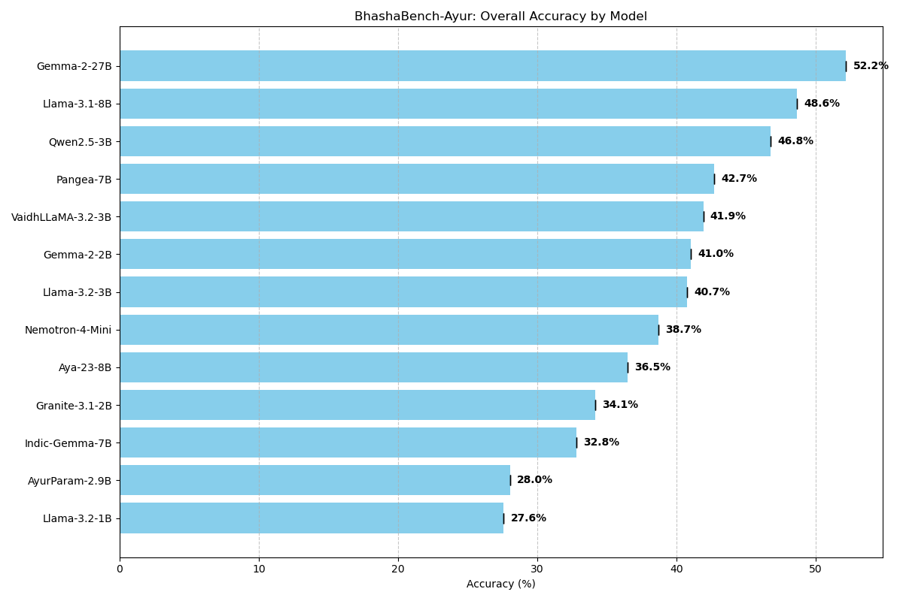
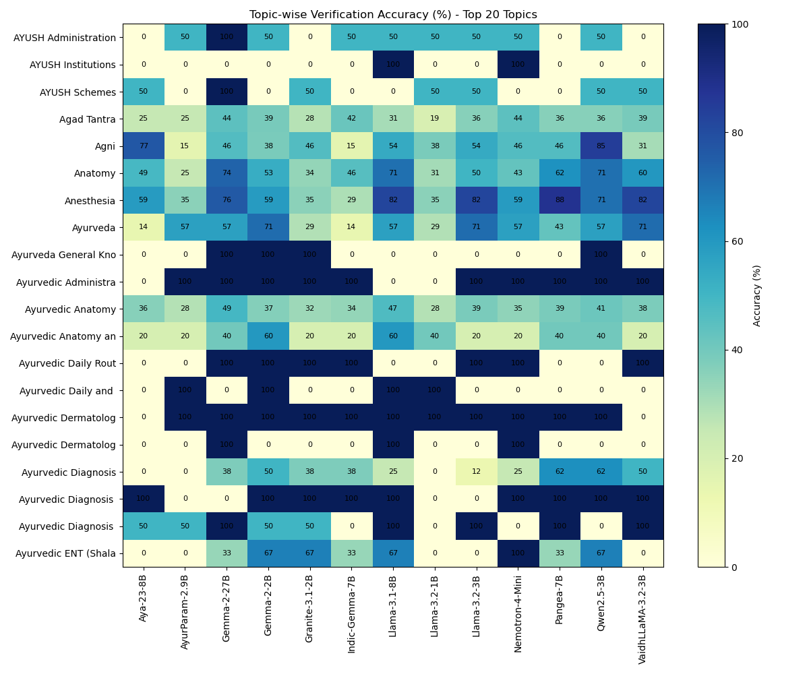

# BhashaBench-Ayur: Benchmark Results

This repository contains the raw evaluation logs and summary results for **VaidhLlama** and other Ayurvedic LLMs on the **BhashaBench-Ayur** benchmark.

**BhashaBench-Ayur** is a specialized evaluation suite designed to test classical reasoning, physiological logic (*Sharir Kriya*), and clinical application in Ayurveda, distinct from generic medical benchmarks.

## Summary Results (Zero-Shot)

| Model | Parameters | Accuracy (%) | Note |
| :--- | :--- | :--- | :--- |
| **Gemma-2** | **27B** | **52.17%** | **Large Model SOTA** |
| Llama-3.1 | 8B | 48.63% | Strong Mid-sized |
| Qwen2.5 | 3B | 46.76% | Strong Baseline |
| Pangea | 7B | 42.72% | Multilingual |
| **VaidhLLaMA** | **3B** | **41.91%** | **Fine-tuned (Ours)** |
| Gemma-2-Instruct | 2B | 41.00% | Efficient Small Model |
| Llama-3.2-Instruct | 3B | 40.74% | Base Model for VaidhLlama |
| Nemotron-4-Mini | 4B | 38.67% | NVIDIA Medical |
| Aya-23 | 8B | 36.47% | Multilingual |
| Granite-3.1 | 2B | 34.15% | IBM Efficient |
| Indic-Gemma | 7B | 32.82% | Indic Focused |
| AyurParam | 2.9B | 28.03% | Previous Attempt |
| Llama-3.2 | 1B | 27.58% | Tiny Model |

## Topic-wise Performance

We evaluated models across diverse Ayurvedic topics. **VaidhLlama** shows consistent improvements over its base model (Llama-3.2-3B) in domain-specific tasks.

Detailed topic-wise accuracy can be found in `topic_wise_accuracy.csv`.

## File Contents

*   `benchmark_summary.csv`: Aggregated performance metrics for all models.
*   `topic_wise_accuracy.csv`: Detailed accuracy breakdown by topic.
*   `benchmark_summary_plot.png`: Bar chart of overall model accuracy.
*   `topic_wise_heatmap.png`: Heatmap of performance across top topics.
*   `results_*.csv`: Detailed row-by-row prediction logs.

## Methodology
All models were evaluated in a **Zero-Shot** setting using valid JSON schema enforcement to ensure parsing reliability.

*   **Metric:** Exact Match (after parsing option keys A/B/C/D).
*   **Prompting:** Standard medical system prompt urging clinical precision.
*   **Infrastructure:** Tested on NVIDIA A6000 Ada (48GB) via vLLM.

## Related Resources
*   **Model Weights:** [Hugging Face (VaidhLLaMA-3.2-3B-Instruct)](https://huggingface.co/Vivekdas/VaidhLLaMA-3.2-3B-Instruct)
*   **Technical Blog:** [VaidhLlama: Engineering Higher Reasoning Density](https://github.com/Vivekdas/VaidhLlama-Blog) *(Link placeholder)*
